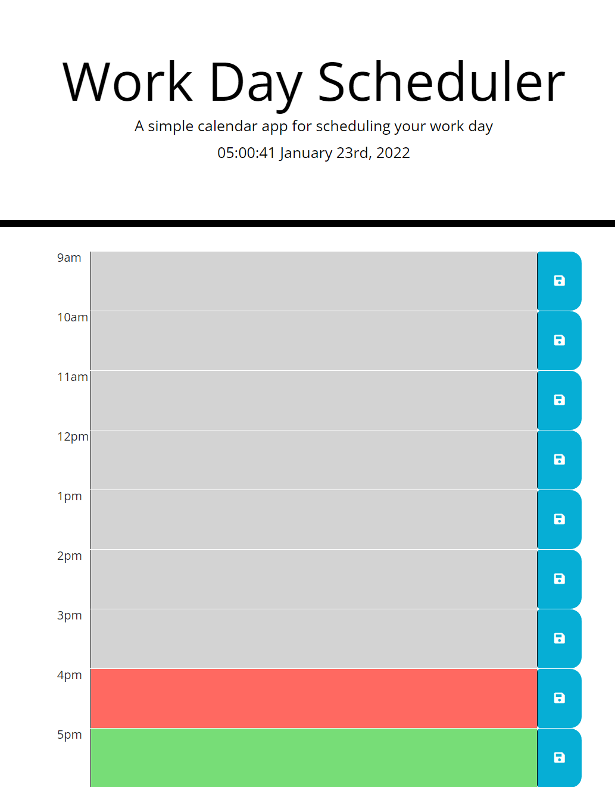

# dayPlanner

Day Planner is a lightweight work day to-do list. it presents the current time of day at the top of the page and provides a to-do list within regular 9-5 business hours. the list will grey out prior hours of the day, red for the current hour and green for future hours. when the save button is clicked that hour gets saved locally to the browser incase the user wants to return.

link
----

A [link](https://holbrookb23.github.io/dayPlanner/)

screenshot
----------

